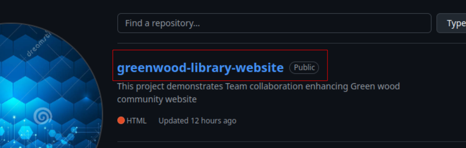
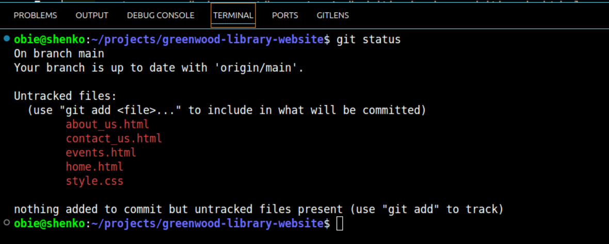
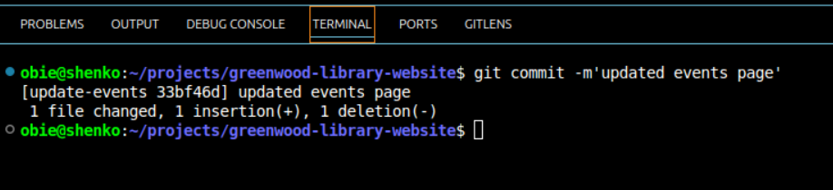
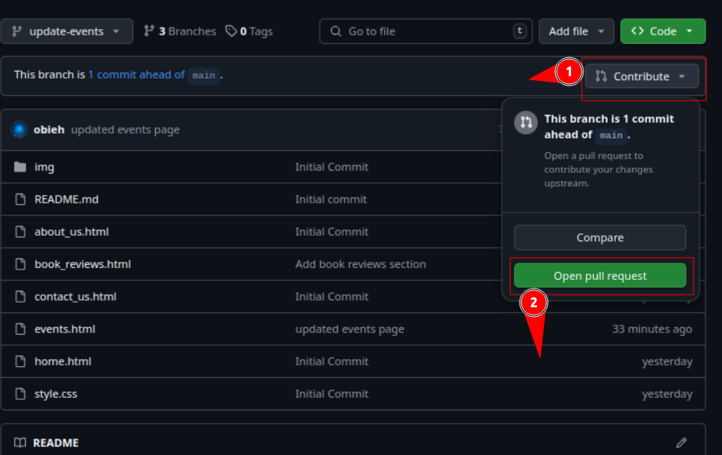

# Greenwood-library-website
This project demonstrates Team collaboration enhancing Green wood community website

## Create a Repository on Github
* Login to your github account and create a repo named greenwood-library-website

## Clone the Repo to your local system 
* Change directory to the project directory and clone the repository you just created.

* `cd projects`
* `git clone <repo url>`

* run `code .` to open the project directory in vscode editor

### Create the files below on vscode editor

* home.html
* about_us.html
* events.html
* contact_us.html

### Stage, Commit and push chnages to main branch(The team.s existing code base for the website)

#### Before staging run `git status` to verify branch and see untracked files(changes)

#### Run `git add .` to stage the new created files

### Run `git commit -m'commit message'` to commit the changes.

### Run `git push origin main` to push changes to remote main branch.

## Morgan's Work(Adding Book Reviews)

1. Create a branch named add-book-reviews for Morgan
* Run `git checkout -b add-book-reviews` to create and switch to the branch

* Add book_reviews.html file to the project root folder

* Run `git add book_reviews.html` on the terminal to stage the chnages made on the book_reviews.html

* Run `git commit -m'commit message'` to commit the changes made(Recall that all these is Morgan's work on the add-book-reviews branch)

* Run `git push origin add-book-reviews` to push changes from local to remote add-book-reviews branch

## Create a Pull Request for Morgan's Work in the add-book-reviews Branch

### Go to your github account Select the add-book-reviews branch.

### Click on 'Contribute' then click 'Open pull request'

### Before creating a pull request for Morgan's contribution be sure to review the difference from the main branch and ascertain everything is okay!
* Review changes made by Morgan

*  Proceed to add description and  create the Pull request for Morgan's contribution 

* After creating the pull request and there is no conflick with the base branch. Click on 'merge pull request' to merge Morgan's pull request.

### Git will require you to confirm merge before actual merging the PR with main

* Write a commit message and click confirm merge

### Git performs merging and confirm that PR has been merged successfully

## Jamie's Work 'Updating Events page'

* On the terminal run `git checkout -b update-events` to create and switch to jamie's branch update-events

### Pull the changes merged to main into Jamie's branch

* Run `git pull origin main` while in Jamie's branch(update-events). This will fetch and merge the latest changes to Jamie's local repo.

* Recall that Jamie's branch is now up to date from after the pull from main. Now add events.html file which is jamie's contribution.

 Run `git status` to view untracked / Modified files

 

* Run `git add evets.html` to stage the event.html file changes

* Run `git status again to verify the file have been staged.

### File color in green signifies the events.html file have been staged ready to commit.

* Run `git commit -m'commit message'` to commit the changes to local repo branch.

* Run `git push origin update-events` to push the changes to remote update-events branch.

## Create a Pull Request to merge Jamie's Contribution which has just been pushed to his remote branch(update-events)

### Go to your github account Select the update-events branch.

### Click on 'Contribute' then click 'Open pull request'

### Before creating a pull request for Jamie's contribution be sure to review the difference from the main branch and ascertain everything is okay!

* Review changes made by Jamie

*  Proceed to add description and  create the Pull request for Jamie's contribution 

* After creating the pull request and there is no conflick with the base branch. Click on 'merge pull request' to merge Jamie's pull request.

### Git will require you to confirm merge before actual merging the PR with main

* Write a commit message and click confirm merge

### Git performs merging and confirm that PR has been merged successfully

